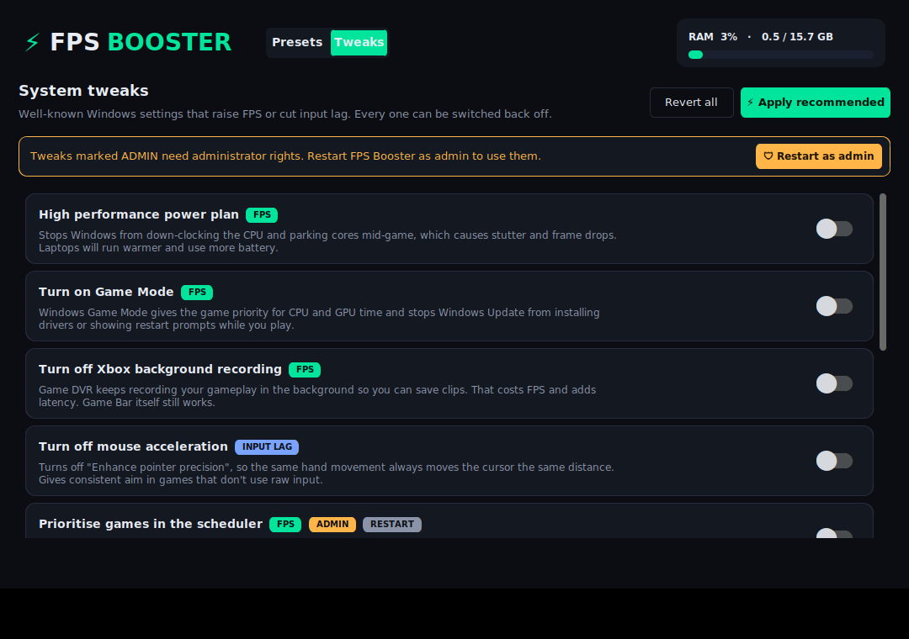

# ⚡ FPS Booster

A small desktop app that closes memory-hungry background programs before you game.

Save up to **5 presets**. Each preset is a list of processes to close. When you
open the app:

- **⚡ BOOST** a preset to close every process in it straight away.
- **✎ Edit** a preset to change which processes it closes.


## Editing a preset

The editor lists running programs grouped by name (e.g. all `chrome.exe`
windows together), in alphabetical order, each with its own icon so you can
tell what it is. Tick the ones the preset should close.


- **Search** and the **memory filter** (All / ≥ 25 MB / ≥ 100 MB / ≥ 250 MB) narrow the list.
- **A–Z / Memory** switches between alphabetical order and biggest memory users first.
- **Ticked only** shows just the processes already in the preset.
- **Add by name** lets you add a program that isn't running right now (e.g. `Discord.exe`).
- Ticked programs that aren't running stay in the list, so you can still untick them.

On Windows the icon is read from the program's `.exe`. If it can't be read
(no icon, or a protected program while not running as administrator), and on
Linux/macOS, a coloured letter badge is shown instead.

After a boost you get a summary of what was closed and how much RAM was freed:


## Tweaks (Windows)

The **Tweaks** tab has well-known Windows settings that can raise FPS or cut
input lag. Each one shows whether it's on, and has a switch to turn it on or off:



| Tweak | Helps | Admin | Restart |
|---|---|:-:|:-:|
| High performance power plan (Ultimate Performance where High is hidden) | FPS, stutter | | |
| Turn on Game Mode | FPS | | |
| Turn off Xbox background recording (Game DVR) | FPS, latency | | |
| Turn off mouse acceleration | Aim consistency | | |
| Prioritise games in the scheduler (MMCSS) | FPS | ✔ | ✔ |
| Turn off power throttling | FPS (mostly laptops) | ✔ | ✔ |
| Turn off network throttling | Network | ✔ | ✔ |
| Turn off Nagle's algorithm | Ping in TCP games | ✔ | ✔ |
| Hardware-accelerated GPU scheduling (not in "Apply recommended") | Latency | ✔ | ✔ |
| Clear standby memory (once, or on every BOOST) | Stutter | ✔ | |

- **Apply recommended** turns on everything except GPU scheduling, whose
  results vary by game and GPU.
- **Revert all** puts everything back the way it was. Before a tweak changes
  anything, your original values are saved to `tweaks_backup.json` (next to
  `presets.json`), so turning a tweak off restores exactly what you had.
- Tweaks marked ADMIN need FPS Booster to run as administrator. The
  **Restart as admin** button does that for you.
- Nothing here turns off security features (Defender, Memory Integrity, etc.).

## Install & run

Requires Python 3.10+ (with Tk, which the python.org installer includes on Windows).

```bash
pip install -r requirements.txt
python main.py          # or: python -m fps_booster
```

Some programs (services, apps started by another user, anti-cheat, launchers
running elevated) can only be closed when FPS Booster runs **as
administrator**. Anything it couldn't close is listed in the boost summary.

## Safety

Critical system processes (`svchost.exe`, `csrss.exe`, `explorer.exe`,
`dwm.exe`, `lsass.exe`, …) are hidden from the list and can't be added, and
FPS Booster never closes itself. Each process is asked to close normally first
and only force-killed if it hasn't exited after 3 seconds. Unsaved work in
the programs you close is lost.

## Where presets are stored

- Windows: `%APPDATA%\FPSBooster\presets.json`
- Linux/macOS: `~/.config/fps_booster/presets.json`

Set `FPS_BOOSTER_CONFIG` to use a different file. Tweak backups are kept in
`tweaks_backup.json` in the same folder.

## Development

```bash
pip install pytest
python -m pytest
```

- `fps_booster/core.py`: process scanning, killing and preset storage (no GUI).
- `fps_booster/icons.py`: program icons (.exe icons on Windows, letter badges elsewhere).
- `fps_booster/tweaks.py`: Windows tweaks, with backup and revert.
- `fps_booster/app.py`: the CustomTkinter UI.
