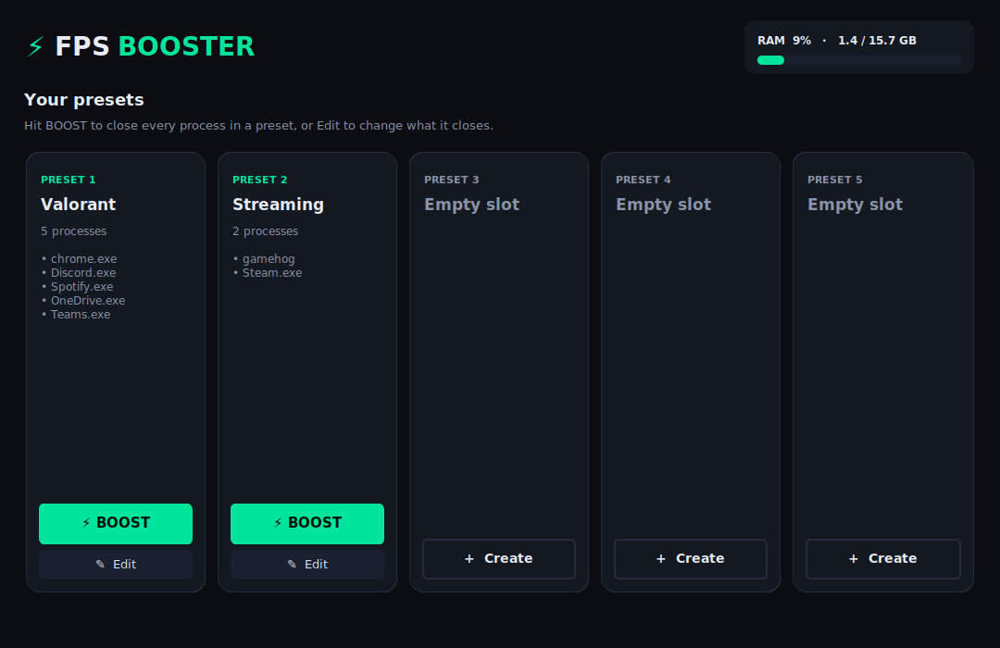
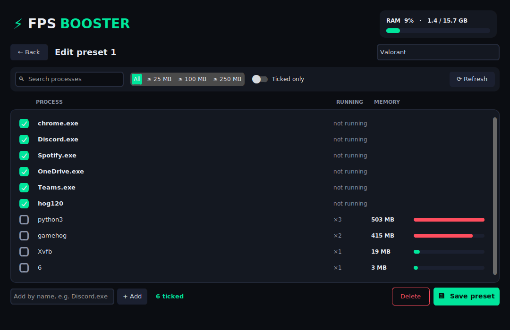
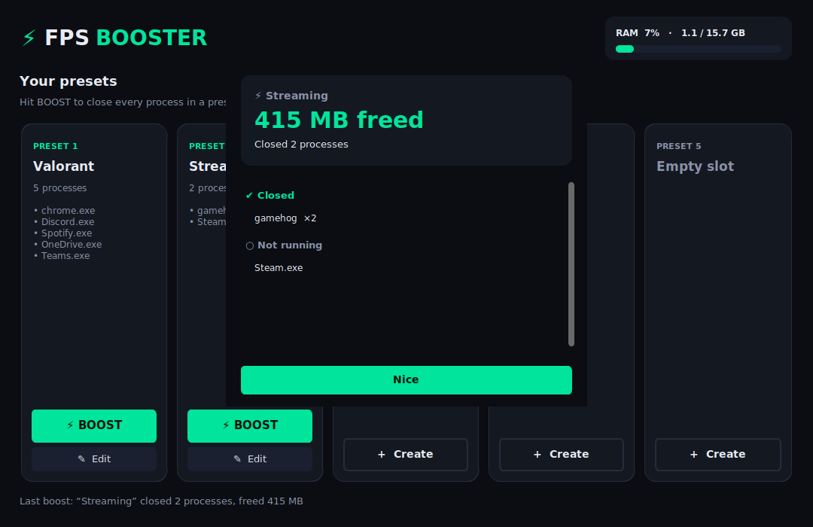

# ⚡ FPS Booster

A small desktop app that closes memory-hungry background programs before you game.

Save up to **5 presets**. Each preset is a list of processes to close. When you
open the app:

- **⚡ BOOST** a preset to close every process in it straight away.
- **✎ Edit** a preset to change which processes it closes.



## Editing a preset

The editor lists running programs grouped by name (e.g. all `chrome.exe`
windows together) and sorted by memory use. Tick the ones the preset should
close.



- **Search** and the **memory filter** (All / ≥ 25 MB / ≥ 100 MB / ≥ 250 MB) narrow the list.
- **Ticked only** shows just the processes already in the preset.
- **Add by name** lets you add a program that isn't running right now (e.g. `Discord.exe`).
- Ticked programs that aren't running stay at the top, so you can still untick them.

After a boost you get a summary of what was closed and how much RAM was freed:



## Install & run

Requires Python 3.10+ (with Tk, which the python.org installer includes on Windows).

```bash
pip install -r requirements.txt
python main.py          # or: python -m fps_booster
```

Some programs (services, apps started by another user, anti-cheat, launchers
running elevated) can only be closed when FPS Booster runs **as
administrator**. Anything it couldn't close is listed in the boost summary.

## Safety

Critical system processes (`svchost.exe`, `csrss.exe`, `explorer.exe`,
`dwm.exe`, `lsass.exe`, …) are hidden from the list and can't be added, and
FPS Booster never closes itself. Each process is asked to close normally first
and only force-killed if it hasn't exited after 3 seconds. Unsaved work in
the programs you close is lost.

## Where presets are stored

- Windows: `%APPDATA%\FPSBooster\presets.json`
- Linux/macOS: `~/.config/fps_booster/presets.json`

Set `FPS_BOOSTER_CONFIG` to use a different file.

## Development

```bash
pip install pytest
python -m pytest
```

- `fps_booster/core.py`: process scanning, killing and preset storage (no GUI).
- `fps_booster/app.py`: the CustomTkinter UI.
